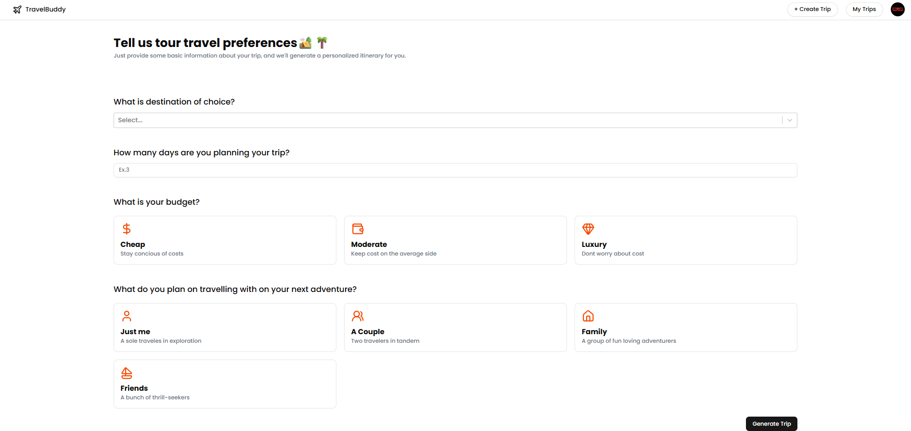

# AI Trip Planner 🌍✈️

An AI-powered travel planning application that creates personalized itineraries based on your preferences, budget, and travel companions.

## Screenshots

### Home Page


### Create Trip


## Features

- 🤖 **AI-Powered Planning** - Generate custom itineraries using Google Gemini AI
- 📍 **Smart Location Search** - Google Places integration for destination selection
- 💰 **Budget Options** - Choose from Cheap, Moderate, or Luxury budgets
- 👥 **Travel Groups** - Solo, Couple, Family, or Friends trip planning
- 🏨 **Hotel Recommendations** - AI-suggested accommodations with pricing
- 🗺️ **Day-by-Day Itinerary** - Detailed plans with timings and locations
- 🔐 **Google Authentication** - Secure login and trip saving

## Tech Stack

- **Frontend**: React + Vite
- **Styling**: Tailwind CSS + shadcn/ui
- **AI**: Google Gemini 2.5 Pro
- **Maps**: Google Places API
- **Database**: Firebase Firestore
- **Authentication**: Google OAuth

## Setup

1. **Clone the repository**
   ```bash
   git clone <repository-url>
   cd ai_trip_planner
   ```

2. **Install dependencies**
   ```bash
   npm install
   ```

3. **Environment Variables**
   Create a `.env` file with:
   ```
   VITE_GOOGLE_PLACE_API_KEY=your_google_places_api_key
   VITE_GOOGLE_GEMINI_AI_API_KEY=your_gemini_api_key
   VITE_FIREBASE_API_KEY=your_firebase_api_key
   ```

4. **Run the application**
   ```bash
   npm run dev
   ```

## Usage

1. **Choose Destination** - Search and select your travel destination
2. **Set Duration** - Enter trip length (max 5 days)
3. **Select Budget** - Pick your spending preference
4. **Choose Companions** - Select who you're traveling with
5. **Generate Trip** - Let AI create your personalized itinerary
6. **Save & View** - Access your trip plan anytime

## Contributing

1. Fork the repository
2. Create a feature branch
3. Make your changes
4. Submit a pull request

## License

MIT License - feel free to use this project for your own purposes.

---

Made with ❤️ by Rishabh